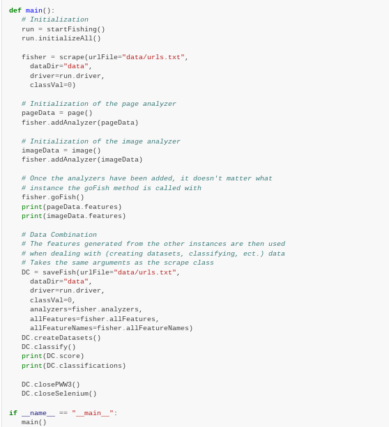
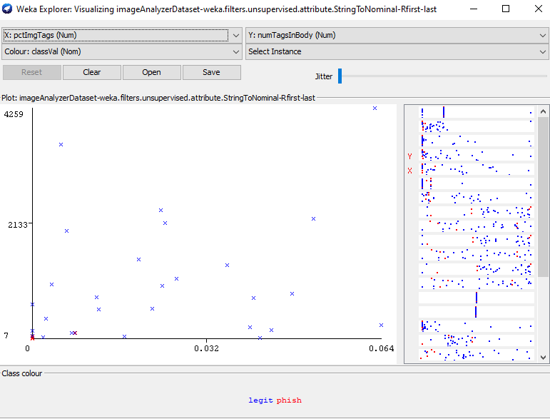
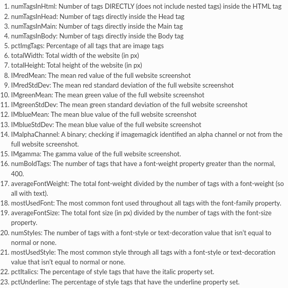

# Fishing for Phish: an Exploration of Web-Based Features for the Purposes of Phishing Detection

## ABSTRACT

With the rise of the Information Technologies industry, the value of personal information
and data has skyrocketed. This has fueled cybercrime, up 600% due to the exploitations of
situations such as the Covid-19 Pandemic and the Russian invasion of Ukraine (PurpleSec LLC,
2021). Phishing in particular has been a common cause of security breaches, data theft, and
malware distribution (PurpleSec LLC, 2021). This research aimed to analyze web-based phishing
via comparison to legitimate domains using classification and regression machine learning
techniques and set forth a simple framework for doing so. By following a mixed methodology
incorporating page source and visual stimuli related features, the researcher hypothesized that data
trends based on intent could be found, and incorporated over time into future machine learning
methods. However, not enough data regarding phishing websites was collected to come to any
substantial conclusions regarding this hypothesis, but the creation of a python module to automate
scraping and feature extraction, feature selection, and other machine learning processes was
programmed, allowing for adaptive feature analysis in the future, and a website was developed, to
showcase the module in a more simplistic fashion and collect data in order to aid future phishing
detection.

## INTRODUCTION

In _Psychology: The Influence of Persuasion_ , Robert B. Cialdini Ph.D. characterized the 6
principles of persuasion as “Weapons of Influence”. This terminology insinuates the danger of
persuasion techniques and tactics and accurately represents the current state of the information
security sector. The “human firewall”, as expressed by Nathaniel Joseph Evans in _Information
technology social engineering: an academic definition and study of social engineering - analyzing
the human firewall_ , is easily exploited using social engineering in combination with persuasive
techniques and deception. Phishing (misleading individuals to reveal sensitive information) in
particular is the cause of 90% of information technology breaches (Sibrian, 2020). Consequently,
this research intends to uncover common patterns and trends via data analysis of the page source
and appearance of phishing websites. The researcher intends to use machine learning (explained by
Priyadharshini Devarajan as the technique of using computer algorithms to find information
intuitively and learn from data without being explicitly programmed to do so) techniques (Sodhi et
al., 2019, as cited in Priyadharshini, 2017) to analyze the variations between phishing websites and
legitimate websites to better understand the relation of certain features to the classification of a
website from a psychological perspective to support predictive phishing classification and detection
efforts.

Many of the current solutions regarding phishing are not preventative, but reductive. For
example, blacklisting, where identified phishing sites are blocked, may help mitigate damages
caused by these sites but does nothing regarding new sites or phishing on a more global scale
(Chiew et al., 2019). However, machine learning (the process of using artificial intelligence to
analyze data, and then classifying and/or making predictions regarding that data) is reactive, using analyzed patterns and trends from input data to make generalized predictions regarding, and
classify, new data in a process known as regression (Sodhi et al., 2019). By taking a machine
learning approach to phishing detection and analysis, features (indicators of a phishing website)
can be more effectively and accurately analyzed, patterns and trends in the phishing dataset can be
deduced, and predictions based on these patterns can be made. These results can lead to greater
insight into phishing, which can then contribute to phishing detection efforts, and allow for further
psychological analysis, specifically regarding the persuasive reasoning behind and the effectiveness
of certain features relative to the “human firewall”.

While it is difficult to predict the outcome of a machine learning model due to the excessive
amount of variable data (in the context of a human analysis at least), it is reasonable to predict that
the patterns and trends of phishing websites will reveal commonalities in phishing and to assume
that these commonalities have psychological motivation and intent behind them, because of the
deceptive nature of phishing websites. With this in mind, the hypothesis can be made that phishing
websites will have similar data trends and patterns in order to mislead users and that the main
feature differences between the real and legitimate sites are correspondent with intention, and,
because of this, these differences can be analyzed for psychological impact and effectivity.

## LITERATURE REVIEW

Information technology is a constantly evolving field and phishing is a constantly evolving
practice. With the rise of new communications technology, new social engineering strategies have
arisen to help aid cyberattackers. It is important to analyze prior research regarding human
susceptibility and vulnerability to psychological manipulation, as well as research regarding
phishing machine learning analyses before conducting research relative to gaps in prior literature.
In the dissertation _Information technology social engineering: an academic definition and
study of social engineering - analyzing the human firewall_ Nathaniel Joseph Evans sought to
analyze social engineering in the information technology field. Evans defined social engineering as
“the exploitation of human vulnerabilities in a cyber-context”, and analyzed various psychological
persuasive models (for example the trust model **,** where the attacker abuses the benevolence and
integrity of a person for personal gain) and principles (for instance how linguistics can be used to
manipulate people) in order to gain a better understanding about the human decision-making
process, and how it could be influenced.

Furthermore, Robert B. Cialdini compiled overall findings over years of study and research
into an educational text on the psychology behind persuasion. Cialdini mainly focuses on the
principles of psychological persuasion (or, as he calls them, “weapons of influence”) which could
be used for the purpose of social engineering. These principles include the contrast principle,
reciprocation, consistency and commitment, social proof, the friendship principle, authority, and the
scarcity principle. Each of these principles influences the decision-making process, largely because
as society has changed, humans have evolved and sub-consciously automated aspects of the
decision-making, which these principles exploit. Cialdini dives into each of these principles, providing examples of how they work, how they are effectively used, and countermeasures against
each one.

Moreover, Rosana Montañez, Edward Golob, and Shouhuai Xu explored types of human
cognitive exploitation in the context of social engineering in information technology. The authors
determined four major components of cognition: perception, working memory, decision making,
and action, which became the focus of the study. Some short-term impacts on cognition the authors
researched and analyzed are workload (the demand of a cognitive task), stress (the importance of a
cognitive task; causes tunneling/ignorance), and vigilance (change in cognitive performance over
time when working on a task). The authors acknowledged some long-term factors that influenced
behavior and therefore possible responses to a social engineering attack, including personality,
expertise, social differences, and culture. Overall, the authors concluded that the decision-making
could be manipulated into immediate action by abusing automatic behavioral instincts developed
from long-term psychological factors.

Additionally, Jeyakumar Samantha Tharani and Nalin A. G. Arachchilage explored the
strategies used by phishers to mimic and create phishing URLs in order to trick internet users in
_Understanding phishers' strategies of mimicking uniform resource locators to leverage phishing
attacks: A machine learning approach_. The authors first reviewed prior research regarding feature
selection (a variety of methods for choosing which features to analyze and use in the machine
learning process) and found a lack of analysis of specific features of phishing URLs, so the authors
used the information gain (calculates the amount of information of a feature relative to the
probability that it appears) and chi-squared (tests the independence of two features) feature
selection methods on the dataset provided by Dr. Colin Choon Lin Tan. The authors determined
that _PctNullSelfRedirectHyperlinks_ , _FrequentDomainNameMismatch_ , _SubmitInfoToEmail_ , _PctExtResourceUrls_ , _InsecureForms_ , _ExtMetaScriptLinkRT_ , _PctExtNullSelfRedirectHyperlinksRT_ ,
_NumDash_ , _IframeOrFrame_ , _NumSensitiveWords_ , _PctExtHyperlinks_ , _NumNumericChars_ and
_NumDots_ were the most significant features, with null self-redirect hyperlinks present in a URL
and a different domain name in the majority internal site hyperlinks being the most commonly
utilized techniques out of those analyzed.

Lastly, Ankit Kumar Jain and B. B. Gupta researched phishing using visual similarity in
_Phishing Detection: Analysis of Visual Similarity Based Approaches._ Specifically, Jain and Gupta
analyzed deceptive website appearances, including techniques such as embedding images to hide
content and similar appearances and Favicon image icons. Methods such as pixel-based analysis
and image extraction were performed in order to collect data regarding style and layout relative to
the page source that can be compared to the original page for visual similarity analysis. Jain and
Gupta discussed the relationship between image-processing and visual similarity approaches, with
time and computational consumption, as well as a lack of data regarding zero-hour (immediate)
phishing detection.

Overall, existing research on approaches to analyzing web-based phishing techniques and
features in the information technology field and psychological research on persuasion and the
decision-making process helped guide this study. Due to the recency of the field of phishing in
information technology, there are gaps in research, particularly regarding the psychological
understanding and analysis of phishing features, especially in the context of a phishing and
legitimate comparison of page and image features.

## METHODOLOGY

> Resources found in Appendix A referenced throughout the paper from this point on

1. https://doi.org/10.17632/h3cgnj8hft.
2. https://phishstats.info/
3. https://domcop.com/top-10-million-domains
4. https://github.com/xanmankey/FishingForPhish.git
5. https://github.com/xanmankey/PhishAI.git
6. https://phish-ai.vercel.app/
7. https://pypi.org/project/FishingForPhish/0.3.0/
8. https://fishingforphish.readthedocs.io/en/latest/

In regards to a procedure, it is difficult to be specific, as machine learning is an adaptive
methodology, where one decision induces another, and experimentation is encouraged to obtain
unique data that may be useful for accurate phishing detection. However, a formulated plan was
created prior to conducting the methodology, involving many resources that can be used for future
phishing detection, all of which can be found in the footnote below, and have a separate appendix
entry. In order to find persuasive methods and patterns employed in web-based phishing scenarios,
the researcher initially chose a machine-learning content-analysis based methodology to gain a
better understanding of web-based phishing, based on prior proposed trends, patterns, and research
and expanding upon the method found in _Understanding phishers' strategies of mimicking uniform
resource locators to leverage phishing attacks: A machine learning approach_ by combining it with
a new set of image-based features determined based on prior research, in particular _Phishing
Detection: Analysis of Visual Similarity Based Approaches_ , as well as image-hashing techniques
provided by the imagehash python module (in particular the perceptual and difference hash
algorithms due to their comparison-based natures) to use visual similarity for immediate detection
based on respective prior hash values. By providing an alternative image-hashing technique, it
allows the module to be repurposed and utilized for hash-based detection purposes, as well as
serves to optimize runtime. The researcher determined that a machine learning approach on the
datasets _Phishing Dataset for Machine Learning: Feature Evaluation_ (originally found at 1,
consists of 10000 instances and 48 attributes, 5000 legitimate and 5000 phishing), _phish_score.csv_
(originally found at 2, the top 500 phishing websites were selected via the provided phish_score
ranking system), and _top_ten_million.csv_ (originally found at 3, the top 500 legitimate websites
were selected via the Open Page Rank ranking system), with 6 resulting datasets (full and ranked
feature versions of page-based only, image-based only, and combined feature datasets) would be an
effective mix of page and image-based data for the context of this research, allowing for
comparisons and analysis while also taking into account the time and computational costs of the
methodology. In terms of software, the programs Weka and Python Weka Wrapper3 were chosen,
in particular, due to the useful visualizations of the machine learning process, and VS Code due to
prior experience with the Integrated Developer Environment (IDE). In regards to machine learning
algorithms, the researcher chose to experiment with the Correlational, Information Gain, and
Chi-squared filter feature selection algorithms (in accordance with the research _Understanding
phishers' strategies of mimicking uniform resource locators to leverage phishing attacks: A
machine learning approach_ ; specifically expanding upon the ranked feature subsets provided by
these algorithms in order to obtain a set of features) and the classification algorithms Jrip, J48, and
Naive Bayes, primarily because of their ease of interpretation and analysis and effectiveness
regarding classification and regression. Finally, the researcher decided to include a human analysis
of the resulting data in order to apply background psychological knowledge to the data analysis
process to draw non-numerical conclusions and provide meaning to the outputted data. The
researcher also decided to create a collection of the data at 4 to reflect the dynamism of data
collection, as well as a website integrated with the Github repository at 5 (found at 6 when hosted,
currently offline, as the website is reliant on the python module, and thus a stable release should be
waited for before attempting further user-driven data collection) showcasing the model and allowing for further data collection, to allow for easier collaboration, replication, and future
research.

A machine learning method is especially effective, as phishing attempts are constantly
changing, so an approach that can analyze large amounts of different quantitative and qualitative
data and determine informational features and numerical patterns is essential. However, as the
researcher manually performed the dataset creation steps, the process became exhaustive, with 6
different sets of features as well as 18 different machine learning model results, and ultimately led
to the python module FishingForPhish, an automation of these processes with additional support
for expansions of this methodology, and the website built off of the module, PhishAI, for easy
testing and access to data via a simple web API. FishingForPhish uses the Selenium Webdriver
software (in the case of this research, Firefox was used for security purposes, in addition to a 20.
Ubuntu Virtual Machine to isolate the host device to protect against automatic Javascript malware
infection, as well as Proton VPN (a VPN service) and Open VPN (a VPN protocol), to protect any
data that might be revealed otherwise) to scrape web data from a list of provided URLs, which can
then be used for analysis. PhishAI uses MongoDB (a cloud database hosting provider) in addition
to the FishingForPhish module to create a system where data can constantly be updated and
accessed and the module can easily be experimented with. The replicability of Python modules and
the consistency of data storage also helps drive further research. The python module (at 7 ) and the
documentation (at 8 ) serve to help future researchers examine new features regarding phishing and
provide an easily replicable web-scraping alternative. The usage of the module followed by the
researcher in accordance with the experimental design can be found in figure 1 below.

<ins>Figure 1: Example usage of the FishingForPhish module</ins>

In order to understand the execution of the methodology, it is imperative to understand the
structure of the module that it inspired. The FishingForPhish module is broken down into a few
key classes: the startFish class for setup and initialization, the scrape class, to automate the
web-scraping process, the analyzer class, a base class with guidelines to allow for analyzer creation that is implemented during the scraping process, the pageAnalyzer and imageAnalyzer classes,
inheriting from the analyzer base class and used to analyze the parsed URL data to return
respective feature data, and the saveFish class, for working with machine learning and datasets.
While machine learning may be an effective method for a content analysis of phishing, this
methodology is not without its limitations. Visual and numerical datasets were included to get a
comprehensive content analysis, but overall only 300 websites were initially considered. In the
global scope of phishing, especially in the context of an evolutionary field, this amount is not
substantial enough to justify any great conclusions. Additionally, the evolutionary nature of
phishing and a popular aversion to web scraping (extracting web-based data for numerical and
other applications) makes it hard to parse and analyze phishing and legitimate websites alike.
However, the data collected and analyzed from this methodology and from the website, as well as
the provided module, can help support other research and provide a good foundation for further
experimentation.

## RESULTS

Quantitative data was obtained for two sets of features built on two analyzers: the
pageAnalyzer (a version of Dr. Tan’s original scraping code, with added python3 functionality and
adapted to act as an analyzer class) and the imageAnalyzer (based on the features selected from the
research at _Phishing Detection: Analysis of Visual Similarity Based Approaches_ ). The data can be
found in two places: either by downloading the data.db file that contains the data from this research
and working with it via an SQL database engine or by accessing the API set forth at 6 and
downloading the data from individual MongoDB collections or downloading the entire MongoDB
cluster (which is updated over time with the website). Out of the 300 selected websites, data for 37
was scraped, with a near 6:1 legitimate to phishing ratio. The datasets and scraped data can be
found in .arff dataset files in the _datasets_ directory at 4 and in the _css_ , _html_ , and _screenshots_
directory respectively. In order to gain a full understanding of the data, it is recommended to load
the datasets in Weka GUI, so as to take advantage of the automated graphing capabilities found
under the _Visualize_ tab, which can be used to better grasp the meaning of data through visualization
in order to determine relationships. Examples of this process can be found in figures 2.1 and 2.
below, specifically a matrix of feature versus feature graphs regarding the imageAnalyzer dataset,
and specific adaptations and customizations of a single graph.

<ins>Figure 2.1: Matrix of feature versus feature graphs</ins>

<ins>Figure 2.2: Customizing a single Weka graph using customization capabilities</ins>

The full sets of features can be found and are elaborated upon, with the page features in
more depth at _Understanding phishers' strategies of mimicking uniform resource locators to
leverage phishing attacks: A machine learning approach_ and the image features in figure 3 below.

<ins>Figure 3: Documented set of image features</ins>

Additionally, the top ten ranked features for the page and image features, as well as the
combined ranked features for the ranked dataset (composed of the top 10 selected ranked features
overall following the combination of the two feature datasets), are listed in figures 4.1, 5.1, and 6.
below, with the figure index corresponding with the set of features and related information.

<ins>Figure 4.1: Ranked page feature data</ins>
| Ranking | Feature |
| ------- | ------- |
| 1       |  ExtMetaScriptLinkRT |
| 2       |  PctExtNullSelfRedirectHyperlinksRT |
| 3       |  NumNumericChars |
| 4       |  PathLength |
| 5       |  PathLevel |
| 6       |  NumAmpersand |
| 7       |  RandomString |
| 8       |  NumQueryComponents |
| 9       |  UrlLength |
| 10      |  HostnameLength |

<ins>Figure 5.1: Ranked image feature data</ins>
**Ranking Feature
1 mostUsedFont
2 averageFontSize
3 numBoldTags
4 favicon
5 numTagsInMain
6 pctImgTags
7 IMgreenMean
8 IMredMean
9 pctUnderline
10 IMblueStdDev**

<ins>Figure 6.1: Combined ranked feature data</ins>
**Ranking Feature
1 averageFontSize
2 mostUsedFont
3 numBoldTags
4 NumDots
5 PathLevel
6 mostUsedStyle
7 favicon
8 UrlLength
9 pctUnderline
10 totalHeight**

Furthermore, classification data for the page, image, and ranked data can be found in the
appendix in 3 sets of figures: 4.2, 4.3, 4.4, 5.2, 5.3, 5.4, and 6.2, 6.3, 6.4 respectively. For the full
output files, view the _output_ directory at 4. An example classification output file can be seen in
figure 6.3 below.

There are a couple of key things to note regarding the Jrip model output seen in figure 6.3,
specifically the accuracy percentage, 86.4865%, and the confusion matrix, which represents the
number of correct and incorrect classifications for each class, defined more technically as true
positives (for example, there are 3 true positives, 3 sites that were classified as phishing and are
phishing websites) false positives, true negatives, and false negatives. Additionally, it’s important to
note that the classification models selected serve to generate interpretable data to allow for a better
understanding of how the model learned (for example the Jrip algorithm functions by generating
subsets of feature rules), and in this case, although not reflected in the screenshot (the full output files can be found at 4 if desired), Jrip outputs the rules _(numTagsInHead <= 8) and
(numTagsInHead >= 7) => classVal=phish (5.0/0.0)_ and _=> classVal=legit (32.0/1.0)_ , where _=>_
is prefaced by a rule (if one exists).

Finally, the database functionality (the error functionality in particular) provided by the
FishingForPhish module allows for further analysis and adaptation of the code. Running SQL (a
programming language used for managing and manipulating data) commands known as queries on
the data.db database at 4 allows users access to a variety of data. This includes a complete set of
errors and their associated URLs with the command _SELECT * FROM errors_ , where 404 (page
not available) and 403 (page available, but forbidden from user access) error codes were more
prevalent than any other error condition, as seen in the error distribution, which can be calculated
via SQL _COUNT_ syntax and logic, the complete feature data sets, except accessible via a database
format, the metadata of a scraped URL, which includes a list of all successfully-scraped URLs and
the original time the scraping process begun, useful for obtaining runtime and experimental
information regarding the module, and associated hash values (in particular perceptual and
differential hash values) for each URL, where SQL _JOIN_ functionality can be used on the _urls_
column to automate hash comparisons.

## DISCUSSION

This research was driven by a lack of psychological analysis and comparison of phishing
and legitimate features, but inaccuracies during data collection resulted in skewed data and
inhibited analysis. These inaccuracies are demonstrated in figure 6.3, where the classification
(86.4865%) is deceptively high, and represents an unintentional failure, defined in _Failure Modes
in Machine Learning_ as “a formally correct but completely unsafe outcome” (amarshal et al.,
2021). The confusion matrix found in the model output displays the uneven class distribution via
the model output, which influenced the way in which the model learned how to classify phishing
versus legitimate websites. More accurately, it’s not the class ratio of legitimate to phishing
websites (6:1) itself that influences the way the model learns, but rather the lack of data regarding
phishing websites that renders the ability to find trends and patterns insignificant for any detection
outside of the original training data. This issue with the model is amplified by scraping errors that
were unaccounted for upon running the module, which can be found in the errors table in the
database at 4 , with failing to account for websites that were blacklisted or taken down a primary
cause of inaccurate data. The SMOTE Weka filter was not utilized in order to rebalance the
classes, due to the proportion of phishing feature data that was error-related and yet still scraped.
Additionally, if the rules provided by the Jrip model are examined, there is no rule correlated with a
legitimate website classification, as seen in _=> classVal=legit (32.0/1.0)_ at 4 , which implies that
Jrip was unable to find any patterns in the data, and classified as legitimate without any reasoning
or trend, further exposing the inaccuracies of the trained model.
As a consequence of feature data inaccuracies caused during the scraping process, all the
other data from this experiment, while structured and organized effectively for future research and analysis, would lead to inaccurate conclusions if utilized for psychological analysis or machine
learning-based phishing detection. For example, if any of the models were to be utilized for
phishing detection in a web-browsing context, they would likely experience low classification
accuracies and undesirable outcomes, mostly due to inaccurate data being an unintentional failure
of the trained model. Additionally, the lack of training and testing in other environments further
limits the applicability of the models. However, the auto-generation of this structure does lend itself
to further experimentation, and the error functionality provided by the module allows for further
streamlining of the methodology and seamless implementation in future research. Due to the
commonality of 404 and 403 error codes, as well as the prevalence of a temporary loss of internet
(most likely due to the kill switch functionality of Proton VPN, as internet resumed shortly after a
disconnection during the experiment), the siteValidation and checkInternet methods were added to
the scrape class of the module, to check for these errors accordingly in order to reduce data
inaccuracies regarded to blacklisted or suspended webpages, as well as suspend the program in the
case of a disconnection to avoid any external influences on the experiment. The resume and
exitHandler methods were also added to the scrape class to add convenience and structure,
automating proper shutdown of the program upon an exception and allowing users to restart the
program in case of a raised exception midway through. A few exceptions still remain independent,
but this issue regarding error distribution can be solved over time by checking for a specific
exception and updating the database with a consistent error accordingly.

Although the original research question was not directly answered, by providing an
adaptable module that automates the web-scraping process and allows for user-defined feature
analysis, the time spent during data collection, training, feature selection, and classification is
minimized, allowing for more in-depth feature analysis and benefitting future research.

## CONCLUSION

### Limitations

One of the issues with classifying phishing versus legitimate websites is the volatility of
websites. If a phishing website is listed as so on a major phishing database (OpenPhish, PhishTank,
PhishStats, ect.), then the host of the website might shut down the website. This and its associated
errors made the preprocessing of data difficult and occasionally inconsistent. Also, websites
constantly change, and as links are added and visuals change, the raw data shifts as well. This hurts
the replicability of the methodology, as the nature of the data being researched is constantly
changing, as well as contributes to an uneven class distribution and outdated data. The nature of
phishing, constantly evolving in order to deceive current users and adapt to current social and
cultural climates, impacts the significance of the data, as the data will constantly be changing in the
future, and requires immediate and adaptive countermeasures. However, it is important to get as
much data about phishing websites as possible, primarily due to the importance of correctly
classifying a phishing website as such, and the possible repercussions of a false negative, or
classifying a phishing website as legitimate. Despite all the inaccuracies, the purpose of phishing
remains constant, and with it, it is still hypothesized that there are common trends and patterns that
are unlikely to change, allowing prediction via machine learning regression algorithms to maintain
some degree of accuracy as long as detection efforts continue to adapt at a similar pace to phishing
efforts, which the adaptability and replicability of FishingForPhish may be able to help prove.

### Implications

The purpose of this research was to collect and analyze page-based and image-based data
in order to find useful patterns regarding phishing websites versus legitimate websites that can
potentially be used in classification and regression. While data was collected, its inaccuracies due
to the volatility of websites hurt the trained models and limited the applicability and efficacy of
phishing detection, preventing any strong conclusions regarding the effectiveness of combined
page and image-based phishing detection and psychological analysis of the features set forth.
However, an automated and adaptable method following is set forth in the programmed module,
and can be useful to further researchers utilizing web scraping and machine learning processes, and
could be expanded to a greater audience if the programmatic aspects were minimized, particularly
if a GUI were to be implemented.

### Further Research

Further research should be conducted to minimize the outliers and errors caused by the
volatility of phishing and legitimate websites. The tools set forth by this research simplify the
process the methodology was built upon via interactive visualization, and will contribute to data
collection that can be used for future research. There’s still a lot of work to be done, and a lot that
needs to be addressed, for example, PhishAI (the website found at 6 ), was created for the purpose
of testing the current ranked model, as well as adding new data for future use, but will not be
hosted until a successful experiment with accurate data is conducted using the module and possible
security threats on the website and the module are addressed. When the website is hosted, it will
aim to expand the audience by simplifying the process the methodology was built upon via
interactive visualization, and will contribute to data collection that can be used for future research.

Similarly, the FishingForPhish module provides adaptive functionality that follows the
methodology and aids future feature analysis by providing an implemented method for adaptive
data collection regarding features, and allows for new implementations and improvements, with
some possibilities being the addition of psychology-based python libraries (for example PsychoPy)
and an overall refactoring of the code via optimized python libraries such as numpy.

## ACKNOWLEDGEMENTS

I would like to express my gratitude to Dr. Tan for allowing me to adapt his code and
research found at https://www.sciencedirect.com/science/article/abs/pii/S0957417418302070 for
my methodology and to showcase my module; Mr. Terry Luedtke, for helping me refactor my code
and address some programmatic errors; Mr. Daniel Rafie, who reviewed my machine learning
methodology, and will hopefully continue to advise me with future research, Mrs. Rose
Trojanowski, who helped me with networking, Mr. Nicholas Pope, for his statistical advice, Aidan
Dunphy, for making the logo for the website, my friends, for helping test my model and the
website, my family (especially my younger sister Evie) for helping support me throughout this
project and sharing the family computer, and the developers on Github, Stack Overflow, Youtube,
and more for providing programmatic advice and guidance relative to my methodology. This
research wouldn’t have been possible without you, so thank you, and please, continue to support
future researchers throughout the research process. The value of your help should not be
underestimated.

## REFERENCES

2020 Internet Crime Report. (2020).
https://www.ic3.gov/Media/PDF/AnnualReport/2020_IC3Report.pdf
Abdelnabi, S., Krombholz, K., & Fritz, M. (2020). VisualPhishNet: Zero-Day Phishing Website
Detection by Visual Similarity. ArXiv:1909.00300 [Cs].
https://arxiv.org/abs/1909.00300
A Decadal Survey of the Social and Behavioral Sciences: A Research Agenda for Advancing
Intelligence Analysis. (2019). In [http://www.nap.edu](http://www.nap.edu) (pp. 141–189). National Academy of
Sciences. https://www.nap.edu/read/25335/chapter/10#144
Agrafiotis, I., Nurse, J. R. C., Goldsmith, M., Creese, S., & Upton, D. (2018). A taxonomy of
cyber-harms: Defining the impacts of cyber-attacks and understanding how they
propagate. Journal of Cybersecurity, 4(1). https://doi.org/10.1093/cybsec/tyy006
Amarshal, alexbuckgit, v-savila, & TerryLanfear. (2021, December 1). Failure Modes in
Machine Learning - Security documentation. Docs.microsoft.com.
https://docs.microsoft.com/en-us/security/engineering/failure-modes-in-machine-
learning
Armi, L., & Fekri-Ershad, S. (2019). TEXTURE IMAGE ANALYSIS AND TEXTURE
CLASSIFICATION METHODS - A REVIEW. _International Online Journal of
Image Processing and Pattern Recognition_ , _2_ (1), 1–29.
https://arxiv.org/pdf/1904.06554.pdf
Bernick, J. (2020). SOCIAL ENGINEERING STUDY: EXAMINING THE INFLUENCE OF CHOICE
ARCHITECTURES ON TRUST AND PASSWORD PRIVACY Item Type Electronic Thesis;
text.
https://repository.arizona.edu/bitstream/handle/10150/650917/azu_etd_hr_2020
_0015_sip1_m.pdf?sequence=1
Burkholder, G. (2013). ScholarWorks Applying Principles of Psychology to Contemporary
Society.
https://scholarworks.waldenu.edu/cgi/viewcontent.cgi?article=1020&context=sp_
pubs
Chiew, K. L., Tan, C. L., Wong, K., Yong, K. S. C., & Tiong, W. K. (2019). A new hybrid
ensemble feature selection framework for machine learning-based phishing
detection system. Information Sciences, 484, 153–166.
https://doi.org/10.1016/j.ins.2019.01.064
Chen, J.-L., Ma, Y.-W., & Huang, K.-L. (2020). Intelligent Visual Similarity-Based
Phishing Websites Detection. Symmetry, 12(10), 1681.
https://doi.org/10.3390/sym12101681
Cialdini, Robert. (2007). Influence: The Psychology of Persuasion. Www.academia.edu.
https://www.academia.edu/7855636/Influence_The_Psychology_of_Persuasion
Cusack, B., & Adedokun, K. (2018). The impact of personality traits on user’s susceptibility
to social engineering attacks. https://doi.org/10.25958/5c528ffa66693
DomCop (2022). Top 10 million domains >> Based on Open PageRank data.
https://www.domcop.com/top-10-million-domains
Do, C., & Nguyen, H. (2020). Malicious URL Detection based on Machine Learning. IJACSA)
International Journal of Advanced Computer Science and Applications, 11(1).
https://pdfs.semanticscholar.org/2589/5814fe70d994f7d673b6a6e2cc49f7f8d3b9.pdf
Evans, N. (2009). Information technology social engineering: an academic definition and
study of social engineering -analyzing the human firewall.
https://lib.dr.iastate.edu/cgi/viewcontent.cgi?article=1701&context=etd
Halevi, T., Memon, N., Lewis, J., & Kumaraguru, P. (2016). Cultural and Psychological Factors
in Cyber-Security. Researchgate.net.
https://www.researchgate.net/publication/309311875_Cultural_and_Psychological
_Factors_in_Cyber-Security
IEEEWANG, Z., ZHU, H., & SUN, L. (2020). Social Engineering in Cybersecurity: Effect
Mechanisms, Human Vulnerabilities and Attack Methods. IEEE.
https://ieeexplore.ieee.org/stamp/stamp.jsp?arnumber=9323026
Jain, Ankit Kumar, and B. B. Gupta. “Phishing Detection: Analysis of Visual Similarity Based
Approaches.” _Security and Communication Networks_ , 10 Jan. 2017,
[http://www.hindawi.com/journals/scn/2017/5421046/](http://www.hindawi.com/journals/scn/2017/5421046/).
Kleitman, S., Law, M. K. H., & Kay, J. (2018). It’s the deceiver and the receiver: Individual
differences in phishing susceptibility and false positives with item profiling. PLoS
ONE, 13(10). https://doi.org/10.1371/journal.pone.0205089
Mayer, P., Zou, Y., & Kastel, S. (2021). “Now I’m a bit angry:” Individuals’ Awareness,
Perception, and Responses to Data Breaches that Affected Them.
https://www.ftc.gov/system/files/documents/public_events/1582978/now_im_a_b
it_angry_-_individuals_awareness_perception_and_responses_to_data.pdf
Montañez, R., Golob, E., & Xu, S. (2020). Human Cognition Through the Lens of Social
Engineering Cyberattacks. Frontiers in Psychology, 11.
https://doi.org/10.3389/fpsyg.2020.01755
PhishStats. (2014). PhishStats. Retrieved April 18, 2022, from https://phishstats.info/
Priyadharshini. (2017, December 15). Machine Learning: What it is and Why it Matters.
Retrieved December 29, 2017, from Simpli Learn:
https://www.simplilearn.com/whatis-machine-learning-and-why-it-matters-article
Sharma, S., Agrawal, J., & Sharma, S. (2013). Classification Through Machine Learning
Technique: C4.5 Algorithm based on Various Entropies. Citeseerx.ist.psu.edu.
https://citeseerx.ist.psu.edu/viewdoc/download?doi=10.1.1.402.2386&rep=rep1&t
ype=pdf
Sibrian, J. (2020). Sensitive Data? Now That’s a Catch! the Psychology of Phishing.
https://dash.harvard.edu/bitstream/handle/1/37364686/SIBRIAN-SENIORTHESIS
-2020.pdf?sequence=1
Sink, M. (2019). Evolutionary and Social Manifestations of Misled Fear: How Fear
Motivates and Manipulates
https://scholarship.depauw.edu/cgi/viewcontent.cgi?article=1126&context=studen
tresearch
Sodhi, P., Awasthi, N., & Sharma, V. (2019, January 6). Introduction to Machine Learning and
Its Basic Application in Python. Papers.ssrn.com.
https://papers.ssrn.com/sol3/papers.cfm?abstract_id=3323796
Sokolova, M., & Lapalme, G. (2009, July). A systematic analysis of performance measures
for classification tasks. ResearchGate.
https://www.researchgate.net/publication/222674734_A_systematic_analysis_of_p
erformance_measures_for_classification_tasks
Tan, Choon Lin (2018), “Phishing Dataset for Machine Learning: Feature Evaluation”,
Mendeley Data, V1, doi: 10.17632/h3cgnj8hft.1
Tharani, J. S., & Arachchilage, N. A. G. (2020). Understanding phishers’ strategies of
mimicking uniform resource locators to leverage phishing attacks: A machine
learning approach. Security and Privacy. https://doi.org/10.1002/spy2.120

## APPENDIX

### Appendix A– Resource links (citations can be found in references when necessary)

1. https://doi.org/10.17632/h3cgnj8hft.1
2. https://phishstats.info/
3. https://domcop.com/top-10-million-domains
4. https://github.com/xanmankey/FishingForPhish.git
5. https://github.com/xanmankey/PhishAI.git
6. https://phish-ai.vercel.app/
7. https://pypi.org/project/FishingForPhish/0.3.0/
8. https://fishingforphish.readthedocs.io/en/latest/

<ins>Figure 1: Example usage of the FishingForPhish module</ins>

### Appendix B– Weka visualization examples

<ins>Figure 2.1: Matrix of feature versus feature graphs</ins>

<ins>Figure 2.2: Customizing a single Weka graph using customization capabilities</ins>

<ins>Figure 3: Documented set of image features</ins>

### Appendix C– Ranked page features and model output

<ins>Figure 4.1: Ranked page feature data</ins>

**Ranking Feature
1 ExtMetaScriptLinkRT
2 PctExtNullSelfRedirectHyperlinksRT
3 NumNumericChars
4 PathLength
5 PathLevel
6 NumAmpersand
7 RandomString
8 NumQueryComponents
9 UrlLength
10 HostnameLength**

### Appendix D– Ranked image features and model output

<ins>Figure 5.1: Ranked image feature data</ins>

**Ranking Feature
1 mostUsedFont
2 averageFontSize
3 numBoldTags
4 favicon
5 numTagsInMain
6 pctImgTags
7 IMgreenMean
8 IMredMean
9 pctUnderline
10 IMblueStdDev**

### Appendix E– Combined ranked features and model output

<ins>Figure 6.1: Combined ranked feature data</ins>

**Ranking Feature
1 averageFontSize
2 mostUsedFont
3 numBoldTags
4 NumDots
5 PathLevel
6 mostUsedStyle
7 favicon
8 UrlLength
9 pctUnderline
10 totalHeight**

